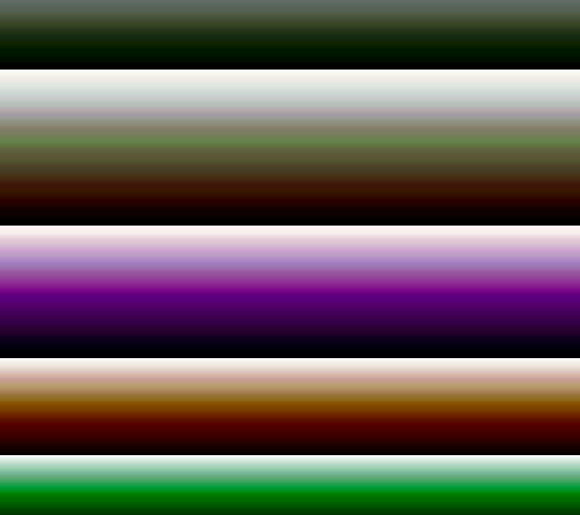

# decrement
Decrement random value in array. Image below demonstrates random decrements in rgb(255,255,255) structure.

(See sample output [test.html](test.html) for full dataset)

    // install decrement
    npm i -S decrement

    // load
    const decrement = require("decrement");

    // cap at range of 0..255
    const control = decrement({min:0, max:255});

    // helper rate change
    const rnd = function (min, max) {
      min = Math.ceil(min);
      max = Math.floor(max);
      return Math.floor(Math.random() * (max - min + 1)) + min;
    }

    // insert objects
    control.insert ( { kind: 'red'   , value: 255 } ) ;
    control.insert ( { kind: 'green' , value: 255 } ) ;
    control.insert ( { kind: 'blue'  , value: 255 } ) ;

    // while above 0
    while( control.total() > 0){

      // find blue and change by a random value in range -2..1
      control.change({kind: 'blue'},  rnd(-2,1));

      // find green and change by a random value in range -2..1
      control.change({kind: 'green'}, rnd(-2,1));

      // find red and change by a random value in range -2..1
      control.change({kind: 'red'},   rnd(-2,1));

      // print some html
      console.log( '
i.value).join() + '); height:1px;">
' );
    }
